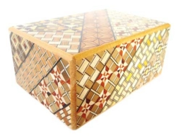

## Early cryptography

You may think that keeping our information secret and secure is a modern obsession. We have passwords for all our different online accounts and are increasingly concerned with other people having access to our information. However, security of information has been a concern for thousands of years and people have been trying to protect information long before the invention of computers. There are many ways to hide information or keep it secret, all of which can be described as some sort of **[Cryptography](https://simple.wikipedia.org/wiki/Cryptography)**. Two common approaches to using cryptography for securing information are *encryption* and *steganography*; these different approaches can be used separately or together.

- **[Encryption](https://simple.wikipedia.org/wiki/Encryption)** allows information to be hidden so that it cannot be read without special knowledge such as a password. This is done with a secret code or cypher. The hidden information is said to be **encrypted**.

  > One of the simplest and earliest methods of encryption is known as the Caesar cipher, named after the Roman emperor Julius Caesar, and involves "shifting" each letter a certain amount through the alphabet. So if the shift was 5, then *a* would become *f*, *b* becomes *g* and *c* turns into *h*. To have a go encrypting and decrypting with the Caesar cipher, try this [activity](http://www.geogebra.org/m/1342697).

- **[Steganography](https://en.wikipedia.org/wiki/Steganography)** involves trying to hide the existence of some secret information; this information could itself be in plain text or encrypted. There are many ways that people have hidden information throughout history. Some early examples:

  > Ancient Greek messengers would have a message tattooed on their shaved head and then travel to their destination once the hair had regrown.  
  
  > Messages have been written under postage stamps to hide their existence.  
  
  > Text or objects were hidden inside ornate boxes with secret compartments, or requiring a complex technique to open them. These boxes were popular in Japan where they are known as *Yosegi*; the boxes usually require many steps to open them.  

  |  | <iframe width="256" height="192" src="https://www.youtube.com/embed/2A-I5J19GKI" frameborder="0" allowfullscreen></iframe> |
  |------------------------------|-------------|

Now it's your turn to make a digital puzzle box like the ones shown above. Using a Raspberry Pi and a Sense HAT add on board, you will "hide" a message behind a series of locks or puzzles that the user will have to solve. You'll be making use of the sensors built into the [Sense HAT](https://projects.raspberrypi.org/en/projects/astro-pi-guide/) for your puzzles.

