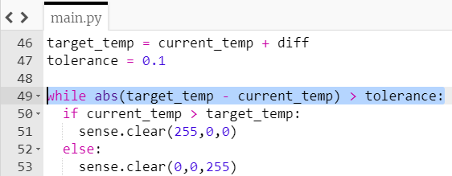

## Check for unlock

At the moment your lock will only check the temperature once. The next part of your lock program needs to repeatedly check the temperature until it reaches, or is close to, the target temperature.

You can use the `abs()` function to find out how big the difference between the current temperature and the target temperature is, ignoring whether the difference is positive or negative.

```python
abs(target_temp - current_temp)
```

+ Create a variable called `tolerance` - this is how close the current temperature will have to be to the target temperature for the lock to be unlocked. You can set the tolerance as `0.1` to begin with, and adjust it if you want to make the lock easier or harder to unlock.

**Note:** If you are using the Sense HAT emulator you will need to set the tolerance to `1` because it is not possible to simulate temperature changes with sufficient precision. However, this means that you will also have to change your range of `temp_diffs` because if a diff is chosen that is less than 1, your box will instantly unlock!

+ Create a `while` loop that runs while the difference between the current temperature and the target temperature is larger than the tolerance. Put the code you wrote to display the colours in the while loop by **indenting** it.

[[[generic-python-while-counter]]]

--- hints ---
--- hint ---
Use the `abs()` function to find the size of the difference between the temperatures, and then compare that difference to 0.1
--- /hint ---

--- hint ---
Here is how your code should look:


--- /hint ---

--- /hints ---

You might expect the colour to change if you move the temperature slider, but if you try this while the program is running, it won't work. Why?

--- collapse ---
---
title: Answer
---
Once the program enters the `while` loop, the current temperature is never updated. It remains exactly the same, so there is no chance of the colour ever updating and no chance that the loop will ever end.
--- /collapse ---

+ Fix this problem by adding a line of code to take the current temperature **inside** the loop. Don't delete or move the original line of code which takes the temperature though as you still need that to take the ambient temperature at the start.

### Display the unlock picture
You already have the code which displays the locked image followed by the unlocked image. Ensure that this code is situated after your while loop and not indented.

+ To test your lock, you could carefully hold your Raspberry Pi near a heater or an open window to affect the temperature.
