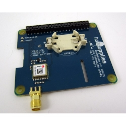
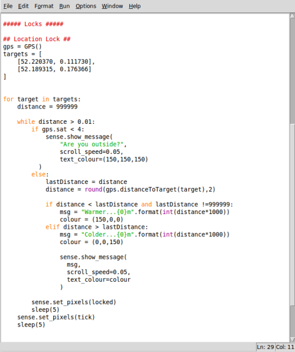

# Puzzle Box - Location Lock
In this activity, you will learn how to create a location-sensitive lock for your Sense HAT Puzzle Box; before working through this activity, you should have completed the initial [worksheet](worksheet.md) and have the code shown below.


## Additional hardware
In order for your Raspberry Pi to know its location, it will need to use a technology know as GPS (Global Positioning System) which uses communication with satelites to determine a position.

Your Raspberry Pi will need to communicate with at least four GPS satelites to get a accurate location. By timing the speed of this communication, the distance from each satelite can be calculated. Once we know the distance to all four satelites, a 3D position on Earth can be given in terms of:
  - **Latitude**, the distance north or south of the Equator. Positive distances are north and negative distances are south.
  - **Longitude**, the distance east or west of the Greenwich Prime Meridian in London. Positive distances are east and negative distances are west.
  - **Altitude**, the current height above sea level.

You'll need to add GPS functionality to your Raspberry Pi. This can be done in a number of ways but the easiest (when using the Sense HAT) is to use the GPS Expansion Board from HAB supplies.



Ensure you have followed the [hardware](hardware.md) and [software](software.md) setup instructions before continuing.

## The lock mechanism
Before you begin writing the code to make your location lock mechanism, it's important to understand how it will behave and how you will create that behaviour with code.

In this activity you'll make a program that does the following:

- Create a `gps` object which continually checks for GPS data, and it also sets up a list of destination(s) which the user must visit.
- Calculates the distance from the first target location
- Continually checks the distance to the target location until you are within 10m of it. Prompts you as whether you are getting closer or farther away.
- Finally, once all the target destinations have been visited the program will give indication that the temperature lock is unlocked.

The list above roughly describes the program your going to write and is called an **algorithm**, or set of instructions. We can make this algorithm more precise by breaking the steps up into smaller tasks; in computer science we call this **decomposition**.

Here's the same algorithm written in a slightly more detailed way:

> ##### Create a GPS object & destinations.
> > Import a GPS object from the piGPS module which once created will continually read and translate data from the GPS board.  
> > Create a list of Latitude,Longitude pairs that the user must visit.

> ##### Displays a clue about the location that the user needs to go to.
> > For each location the current *distance* is set to a large number (999999km)  
> > A loop begins which only exits when the current *distance* gets below 0.01km (10m)  
> > > If the *gps* object is in contact with less than 4 satelites then a message is displayed to tell the user to "go outside"  
> > > Otherwise the current *distance* is stored in the *lastDistance* variable and the distance is recalculated using the current position.  
> > > Depending on whether the current *distance* is larger or smaller than the *lastDistance*, the message *"warmer"* or *"colder"* is displayed plus the *currentDistance*  
> > > The locked image is then displayed for 5 seconds  
> > When a location is reached a green tick is displayed and the next location is selected.  
> When the final location has been reached, the location lock is unlocked and the program continues on to display the secret message.   

## Add GPS library and new image.
If you have followed the [software](software.md) instructions, you should have a copy of the *piGPS* library installed and tested.

1. To add this to your Python program, go the the **Import** section and add the line:

  ```python3
  from piGPS import GPS
  ```

1. You will also want to add a pixel art image to your program to indicate when a target location has been reached. Here a green tick has been used, but this could be substituted for something else (smiley face, crosshair etc).

  

To add this to you code create a new pixel art image in the **Pixel Art** section.

  ```python3
  tick = [
    e,e,e,e,e,e,e,g,
    e,e,e,e,e,e,g,g,
    e,e,e,e,e,g,g,e,
    e,e,e,e,g,g,e,e,
    g,g,e,g,g,e,e,e,
    e,g,g,g,e,e,e,e,
    e,e,g,e,e,e,e,e,
    e,e,e,e,e,e,e,e
        ]
  ```

1. Finally under your **locks** section create a new lock called **Location Lock**.

## Adding location targets
The program you are going to write needs at least 1 location target but can have many. You will need to create a GPS object and create a list of locations.

1. The first line of you location lock will create a GPS object called *gps* which once created will monitor the GPS board and convert it's raw data into Longitude, Latitude, Altitude as well as other helpful data.

  Add this line after your **Location Lock** heading.

  ```python3
  gps = GPS()
  ```

1. The next step is to choose you destination(s), for each destination you will need a latitude and longitude which you can find using online mapping services such and [Google Maps](maps.google.com).
  - Simply find you chosen location, and right click.

  

  - Then select **What's here** and the latitude and longitude will be show below.

  

1. Choose as many locations as you like and add them to a list in you python script.

  ```python3
  targets = [
      [52.205375, 0.119098],
      [52.202201, 0.128203]
]
```

  Pick nearby locations otherwise you will find tested very difficult!

## Get your user outside
Your user is unlikely to receive GPS signals unless their outside, so you need to check whether they have a signal and if not prompt them to talk a walk. Before you do that there are a couple of other steps to take.

  1. Start a loop which will pick each *target* from the *targets* list, you then set a variable called *distance* the initial (ridiculous) value of 999999km. This value means that the program assumes the next location is far away, until it can work out an accurate distance.

  The value 999999km has been used because it can't be mistaken for a genuine measurement, 999999km is about 25x the distance around the earth.

  ```python3
for target in targets:
    distance = 999999
```

  1. Next you need to start a *while* loop which will continue until your current position is less than 10m (0.01km) from the target position. Within that loop you will need to check whether your gps object is communicating with 4 or more satelites, if not the user is told to go outside.

  ```python3
  for target in targets:
      distance = 999999

      while distance > 0.01:
          if gps.sat < 4:
              sense.show_message(
                "Are you outside?",
                scroll_speed=0.05,
                text_colour=(150,150,150)
              )

  ```

  1. Test this out, if you run your program you should be prompted to go outside. At this point you can either go outside or hang your GPS antenna out a window and it should start to get a GPS signal.

## Checking current distance and feedback.
Once your program begins receiving GPS data it won't currently do anything with it, you'll need to first calculate the distance to the current target and check whether the user is getting closer or farther away.

The piGPS library you imported earlier has a built in function to calculate the distance to the current target. Before finding the current distance you need to store the previous distance in a new variable *lastDistance*. Continue your while loop adding these three lines:

    ```python3
    for target in targets:
        distance = 999999

        while distance > 0.01:
            if gps.sat < 4:
              sense.show_message(
                "Are you outside?",
                scroll_speed=0.05,
                text_colour=(150,150,150)
              )
            else:
                lastDistance = distance
                distance = round(gps.distanceToTarget(target),2)
    ```

  1. Next you need to add a couple of other conditions that check whether the user has gotten closer or farther away. In the first *if* statement you need to check whether *lastDistance* = 999999 if it was then it should be ignored so that the user isn't told they have gotten closer just because a GPS lock has been achieved.

    ```python3
    for target in targets:
        distance = 999999

        while distance > 0.01:
            if gps.sat < 4:
                sense.show_message(
                  "Are you outside?",
                  scroll_speed=0.05,
                  text_colour=(150,150,150)
                )
            else:
                lastDistance = distance
                distance = round(gps.distanceToTarget(target),2)

                if distance < lastDistance and lastDistance !=999999:
                    msg = "Warmer...{0}m".format(int(distance*1000))
                    colour = (150,0,0)
                elif distance > lastDistance:
                    msg = "Colder...{0}m".format(int(distance*1000))
                    colour = (0,0,150)

                    sense.show_message(
                      msg,
                      scroll_speed=0.05,
                      text_colour=colour
                    )


    ```

  1. The last bit of feedback to do is to display the locked symbol for 5 seconds using these two lines.

    ```python3
    for target in targets:
        distance = 999999

        while distance > 0.01:
            if gps.sat < 4:
                sense.show_message(
                  "Are you outside?",
                  scroll_speed=0.05,
                  text_colour=(150,150,150)
                )
            else:
                lastDistance = distance
                distance = round(gps.distanceToTarget(target),2)

                if distance < lastDistance and lastDistance !=999999:
                    msg = "Warmer...{0}m".format(int(distance*1000))
                    colour = (150,0,0)
                elif distance > lastDistance:
                    msg = "Colder...{0}m".format(int(distance*1000))
                    colour = (0,0,150)

                    sense.show_message(
                      msg,
                      scroll_speed=0.05,
                      text_colour=colour
                    )

            sense.set_pixels(locked)
            sleep(5)
        ```

## Reaching your destination

Each time the user reaches a step in their journey your program should notify them, this is where your Pixel art comes in, add 2 lines outside your loop to first show the pixel art and then pause before continuing.

  ```python3
  for target in targets:
      distance = 999999

      while distance > 0.01:
          if gps.sat < 4:
              sense.show_message(
                "Are you outside?",
                scroll_speed=0.05,
                text_colour=(150,150,150)
              )
          else:
              lastDistance = distance
              distance = round(gps.distanceToTarget(target),2)

              if distance < lastDistance and lastDistance !=999999:
                  msg = "Warmer...{0}m".format(int(distance*1000))
                  colour = (150,0,0)
              elif distance > lastDistance:
                  msg = "Colder...{0}m".format(int(distance*1000))
                  colour = (0,0,150)

                  sense.show_message(
                    msg,
                    scroll_speed=0.05,
                    text_colour=colour
                  )

          sense.set_pixels(locked)
          sleep(5)
      sense.set_pixels(tick)
      sleep(5)

      ```

Once this loop completes all the targets the program will continue either to the next lock or to the hidden message.

Your complete lock [code](code/puzzle_box_location.py) should look like this, be sure to check the capital letters and indentations carefully.



## Testing your Lock
This lock is tricky to test as you need to go outside. Connect your Raspberry Pi to a Battery pack and take a wander, here's a demonstration:

<iframe width="420" height="315" src="https://www.youtube.com/embed/mGSCdPl_iDs" frameborder="0" allowfullscreen></iframe>

## What's Next?
- You may want to add [other locks](worksheet.md) to your Puzzle Box.
- You could adapt this lock by changing how close the user needs to get, the `while distance > 0.01:` controls this. (0.01 = 10m)
- You could use the magnetometer functionality of the Sense-HAT to create a compass which points the way to each target.
